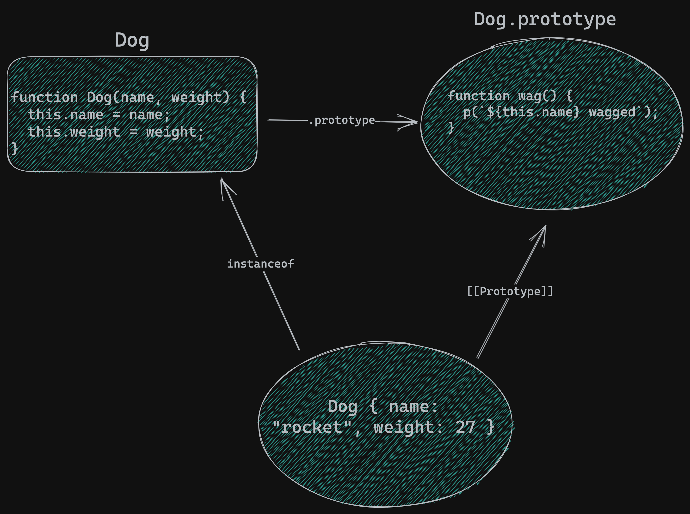

# constructor pattern

- everytime we invoke a function as a constructor, JS creates objects that link to that constructor's _function prototype_, this is how we set up behavior delegation for those create objects

## instances

- individual objects of a specific type (think: `Dog` is `rascal`'s type)
- the term _"instance"_ can be used to describe objects create via the prototype pattern or the factory function pattern, so long as we are defining _multiple_ objects of the same _kind_ which all share an object prototype

## instance properties

- initialized when the constructor is invoked
- properties of a _specific instance_ (e.g a dog `weight` is an instance property of that dog since it is a vital quality of that dog)

## instance methods

> _"Any method defined in any prototype in the prototype chain of an instance is considered to be an instance method of the instance."_

## static properties/methods

- defined on the constructor function itself (e.g a dog's species applies to all dogs (instances of Dog))



```jsx
function Dog(name, weight) {
  this.name = name;
  this.weight = weight;
}
Dog.prototype.wag = function () {
  p(`${this.name} wagged`);
};

const rocket = new Dog("rocket", 27);
```
